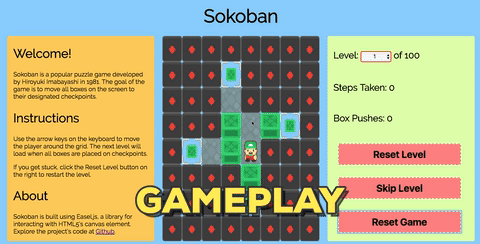

# Sokoban



## Live Link

[Sokoban](https://paskhaver.github.io/sokoban/)

## Background

Sokoban is a puzzle game created by Hiroyuki Imabayashi
in 1981.

The game consists of a grid of squares populated with:

- a single player, who starts in a position that allows for free movement
- multiple boxes that the player can push across the grid
- designated checkpoints, whose count is equal to the number of boxes
- walls / obstacles that neither the player nor the boxes can traverse

The goal is for the player to move all of the boxes to their
designated checkpoints without trapping the boxes in between
the walls or in a corner.

## Features
- Dynamic movement of player across game grid created with Easel.js
- ES6 logic to render grid, move player, check for victory, and transition to next level
- Menu dropdown offers player chance to instantly switch to another level
- Custom actions (reset level, skip level, reset game) to improve user experience
- 30 levels of varying difficulty

## Code Samples

- 4 directions (left, right, up, down) of player movement are handled
by single DRY function with helper methods
```javascript
getAdjacentTiles(direction, row, column) {
  const playerTile = this.getGridObject(row, column);
  const player     = this.playerObject;
  let oneTileFromPlayer, twoTilesFromPlayer;
  switch(direction) {
    case "right":
      oneTileFromPlayer  = this.getGridObject(row, column + 1);
      twoTilesFromPlayer = this.getGridObject(row, column + 2);
      break;

    case "up":
      oneTileFromPlayer  = this.getGridObject(row - 1, column);
      twoTilesFromPlayer = this.getGridObject(row - 2, column);
      break;
    //...
  }
```
- jQuery helper methods update game statistics for
every player action as well as upon level reset

```javascript
function createNewGame(level) {
  //...
  sokoban = new Sokoban(level);
  board = sokoban.board;
  $("#steps-taken").text(board.stepCount);
  $("#box-pushes").text(board.boxPushes);
  $("#level").text(sokoban.level + 1);
  $("#select-level").val(sokoban.level + 1);
}

$("#reset-level").click(event => {
  createNewGame(sokoban.level);
});
```

- Instantiation of a new level iterates over multi-dimensional array of 1-character
strings to create game objects (player, checkpoint, box, wall)
```javascript
compile(textGrid) {
  return textGrid.map((array, rowIndex) => {
    return array.map((symbol, colIndex) => {
      let floor, box, player, checkpoint;
      switch(symbol) {
        case "#":
          return new Wall(rowIndex, colIndex);

        case " ":
          return new Floor(rowIndex, colIndex);

        //...
        case "@":
          floor = new Floor(rowIndex, colIndex);
          floor.player = new Player(rowIndex, colIndex);
          this.playerObject = floor.player;
          return floor;
```
