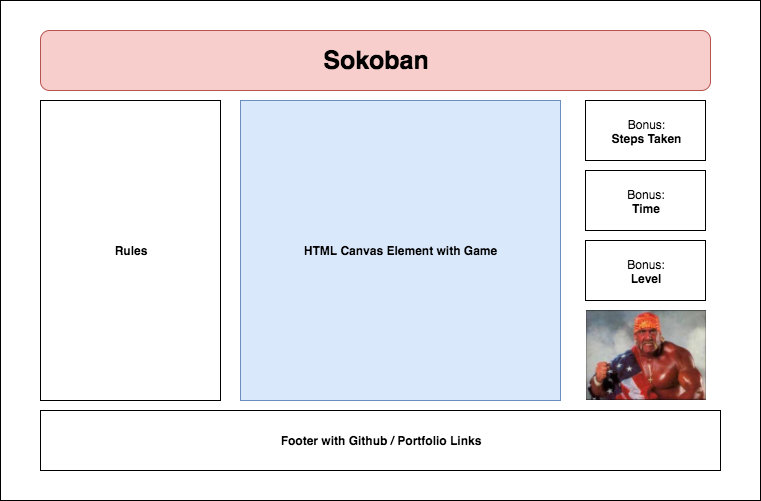

# Sokoban

## Live Link

[Sokoban](https://paskhaver.github.io/sokoban/)

## Background

Sokoban is a puzzle game created by Hiroyuki Imabayashi
in 1981.

The game consists of a grid of squares populated with:

- a single player, who starts in a position that allows for free movement
- multiple boxes that the player can push across the grid
- designated checkpoints, whose count is equal to the number of boxes
- walls / obstacles that neither the player nor the boxes can traverse

The goal is for the player to move all of the boxes to their
designated checkpoints without trapping the boxes in between
the walls or in a corner.

## MVP

Users will be able to
- Move a player around a board with the keyboard
- Push boxes in the direction of player movement
- Restart a round or the entire game at will
- Complete a round by placing all boxes on their designated checkpoints

In addition, the project will include:

- A description box with the rules of the game
- A production README

## Wireframes

Sokoban will be played on an HTML canvas element placed
in the center of the page. Users will control the player
with their keyboard. The player can move in 4 directions (Up, Down,
Left, Right) but is limited by Wall obstacles. Diagonal movement
is not allowed.

If the player touches a block AND the block is
not restricted by a wall, both the player and the block will
move one step in that direction.

A vertical component to the left of the canvas will describe the
rules of the game and potentially provide game statistics
(number of blocks at checkpoint, number of blocks remaining etc).

A vertical component to the right can be used for bonus
features such as level or player selection.

A footer will provide links to my GitHub, LinkedIn,
and portfolio site.

## Technologies, Libraries, API

Sokoban will be built entirely with ES6. The objects
will be visually represented on the HTML canvas element.

JavaScript Classes
- sokoban.js
  - Handles the game logic; determines if the game is complete
   or if there is no way for the player to win (a loss)

- board.js
  - Handles the game grid, a multi-dimensional array consisting of
    other objects

- movablePiece.js - Parent class
  - player.js - Handles player movement. Communicates with board to
    check validity of move. Controlled by keyboard. Limited to one instance.
  - box.js - Communicates with board to determine valid move. Communicates
    with checkpoint on shared location. Few instances.

- checkpoint.js
  - Handles logic for determining if game is over. The # of Checkpoint
  instances will be equal to the number of Box instances. If all boxes
  are placed on checkpoints, the game is won.

- wall.js
  - Handles logic for prohibiting player movement in certain direction.
  - Declares game over if any box is surrounded on 3 sides

## Implementation Timeline

**Day 1** - The Visuals
- Setup React components
  - Header
  - Game (Canvas element)
  - Left Column
  - Right Column
  - Footer
- Add eventlisteners to target the `canvas` HTML element
- Create core JavaScript classes
- Find and render visuals in the canvas (player, crates, walls) to
represent the classes.

**Day 2** - The Logic
- Build the Sokoban game in raw ES6 JavaScript.
- Implement a 2D dimensional array to serve as the board
  - Each row will consist of objects representing the various game components
- Goal by end of day is a JavaScript game that is functional in Chrome's console

**Day 3** - The Bridge
- Tie together the frontend visuals and the JavaScript game.
  - The Player's push of a box should cause the canvas to dynamically adjust.
- The logic of game completion should trigger a canvas reset.

## Bonus Features

- [X] Multiple levels
- Multiple characters
- [X] Track of player's total moves
